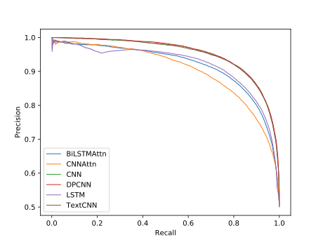

# Text-Classification-PyTorch
This repo implements 7 text classification algorithms(`CNN`, `CNN+Attention`, `TextCNN`, `DPCNN`, `LSTM`, `Bi-LSTM+Attention`, `RCNN`) and a train-eval pipeline.
## Requirements
* python 3.6+
* torch==1.1.0
* pandas
* matplotlib
* nltk
* scikit_learn
## IMDB Dataset
This dataset contains movie reviews along with their associated binary
sentiment polarity labels. It is intended to serve as a benchmark for
sentiment classification. The core dataset contains 50,000 reviews split evenly into 25k train
and 25k test sets. The overall distribution of labels is balanced (25k
pos and 25k neg). We also include an additional 50,000 unlabeled
documents for unsupervised learning. 
## Get Start
1. **Install all the required package.**   
`$ cd Text-Classification-PyTorch`  
`$ pip install -r requirements.txt` 
2. **Download dataset.**  
`$ wget http://ai.stanford.edu/~amaas/data/sentiment/aclImdb_v1.tar.gz`   
`$ tar -zxvf aclImdb_v1.tar.gz`  
3. **Download pre-trained word vectors(Optional).**  
`$ wget http://nlp.stanford.edu/data/glove.6B.zip`  
`$ unzip glove.6B.zip -d glove`  
4. **Initialize data.**  
`$ python initialize.py`  
Or use `$ python initialize.py -h` for help.  
5. **Train.**    
`$ python train.py`  
Or use `$ python train.py -h` for help.  
6. **Evaluation.**  
`$ python eval.py`  
Or use `$ python eval.py -h` for help.  
7. **Check evaluation results.**  
Open `--name` file to view PR curve.
## Training in Google Colab
https://colab.research.google.com/drive/1VJmSx-vThBFlGZYJ9sKWDMINKWOzFNCD
## Training in Docker
1. Pull image  
`$ docker pull wisedoge/text_clf_pytorch`
2. Run  
`$ docker run -it wisedoge/text_clf_pytorch`
## Results
### Parameters
| #    | Param           | CNN   | TextCNN | DPCNN | CNNAtt | LSTM  | BiLSTMAtt | RCNN  |
| ---- | --------------- | ----- | ------- | ----- | ------ | ----- | --------- | ----- |
| 1    | Vocab size      | 30000 | 30000   | 30000 | 30000  | 30000 | 30000     | 30000 |
| 2    | Max seq len     | 256   | 256     | 256   | 256    | 256   | 256       | 256   |
| 3    | Embedding dim   | 256   | 256     | 256   | 256    | 256   | 256       | 256   |
| 4    | Hidden dim      | 512   | 256     | 250   | 128    | 128   | 512       | 128   |
| 5    | Context vec dim | -     | -       | -     | 64     | -     | 64        | -     |
| 6    | Dropout prob    | -     | -       | -     | -      | 0.2   | -         | -     |
| 7    | Num LSTM layer  | -     | -       | -     | -      | 2     | -         | -     |
| 8    | Num DPCNN block | -     | -       | 2     | -      | -     | -         | -     |
    
\* *You can also set `--max_seq_len=512`(longer sequence length) and `--glove_path=your glove path/glove.6B.*d.txt`(use pre-trained word vectors) to build large model for better accuarcy(>= 0.9).*  

### Accuracy
| Model name             | Accuracy on test set |
| ---------------------- | -------------------- |
| CNNAttn                | 0.82340              |
| LSTM                   | 0.83548              |
| CNN                    | 0.85100              |
| RCNN                   | 0.87732              |
| BiLSTMAttn             | 0.87780              |
| TextCNN                | 0.87848              |
| DPCNN                  | **0.87904**          |

### PR-Curve
  

